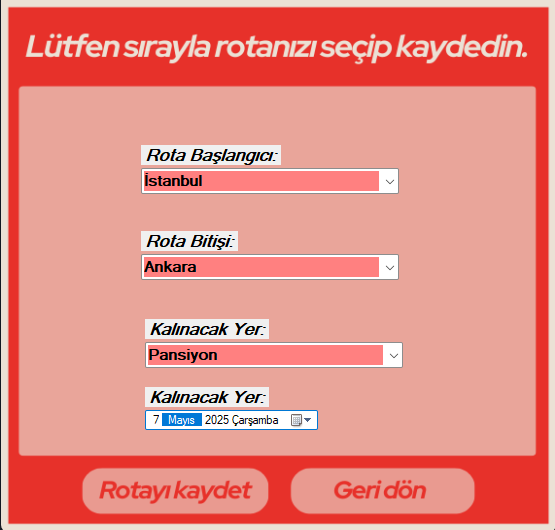
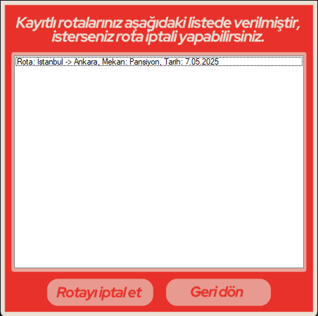

# ✈️ Seyahat Planlama Uygulaması

Bu proje, **C# Windows Forms** kullanılarak geliştirilmiş bir **Seyahat Planlama Uygulaması**dır. Kullanıcılar, seyahatlerini planlayabilir, gidecekleri yerler hakkında bilgi alabilir ve seyahat tarihleriyle ilgili işlemleri gerçekleştirebilir. Proje eğitim amaçlıdır.

## 🧩 Özellikler

- Seyahat planı oluşturma
- Seyahat tarihlerini belirleme
- Gidecek yerler hakkında bilgi gösterme
- Kullanıcı dostu arayüz

## 🛠️ Kullanılan Teknolojiler

- C# (Windows Forms)
- .NET Framework
- Visual Studio
- (Opsiyonel: JSON, XML ya da SQL Server ile veri saklama)

## 🖼️ Uygulama İçi Ekran Görüntüleri

